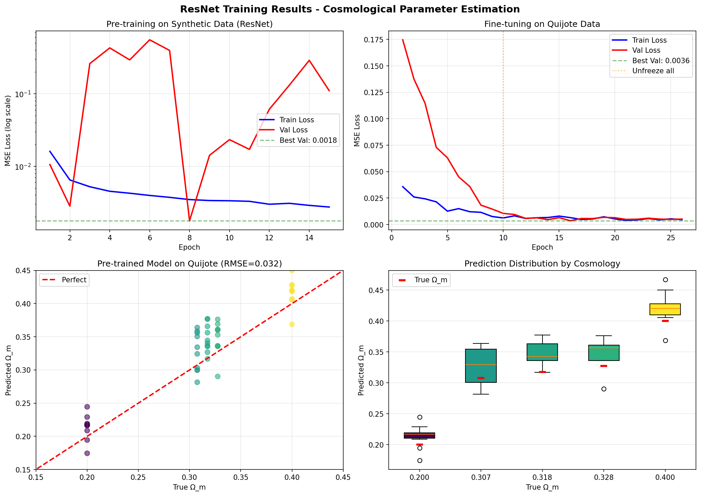

# cosmo-scanner-hpc

**A Deep Learning Pipeline for Cosmological Parameter Estimation**

*A rigorous crash course for Physics PhD students, bridging statistical mechanics, field theory, and modern machine learning.*

---

## Quick Start

```bash
# Train the model (DES-like data, default)
./run.sh --run_name my_experiment --epochs 50

# Train with N-body like data (for Quijote)
./run.sh --data_type 2lpt --epochs 50

# Custom configuration
./run.sh --data_type des --smoothing 5.0 --batch_size 32 --lr 1e-4
```

## Learning Resources

| Resource | Description |
|----------|-------------|
| **This README** | Theoretical foundations with physics analogies |
| [`study/docs/LEARNING_GUIDE.md`](study/docs/LEARNING_GUIDE.md) | Comprehensive tutorial covering tensors, autograd, layers, and training |
| [`study/docs/QUICK_REFERENCE.md`](study/docs/QUICK_REFERENCE.md) | PyTorch cheatsheet for quick lookup |
| [`study/notebooks/02_ml_from_scratch.ipynb`](study/notebooks/02_ml_from_scratch.ipynb) | **Interactive tutorial** - run code and see outputs! |
| [`study/notebooks/01_physics_check.ipynb`](study/notebooks/01_physics_check.ipynb) | Visualize the cosmological data |

**Recommended learning path:**
1. Start with `study/notebooks/02_ml_from_scratch.ipynb` for hands-on coding
2. Read this README for theoretical context
3. Dive into `study/docs/LEARNING_GUIDE.md` for detailed explanations
4. Keep `study/docs/QUICK_REFERENCE.md` open as you code

---

## Table of Contents

1. [Introduction: The Inverse Problem](#1-introduction-the-inverse-problem)
2. [Section A: The Physics of Data](#section-a-the-physics-of-data)
   - [Gaussian Random Fields](#a1-gaussian-random-fields)
   - [The Power Spectrum](#a2-the-power-spectrum)
   - [From Fourier to Real Space](#a3-from-fourier-to-real-space)
3. [Section B: The Architecture (Theory Mapping)](#section-b-the-architecture-theory-mapping)
   - [The Tensor](#b1-the-tensor-as-a-differentiable-field)
   - [Convolution as Green's Functions](#b2-convolution-as-greens-functions)
   - [Pooling as Renormalization](#b3-pooling-as-renormalization)
   - [The Linear Head](#b4-the-linear-head-as-projection)
4. [Section C: The Optimization (Dynamics)](#section-c-the-optimization-dynamics)
   - [The Loss Landscape](#c1-the-loss-landscape)
   - [Backpropagation](#c2-backpropagation-the-adjoint-method)
   - [The AdamW Optimizer](#c3-the-adamw-optimizer)
5. [Installation & Quick Start](#installation--quick-start)
6. [Project Structure](#project-structure)
7. [HPC Deployment](#hpc-deployment)
8. [References](#references)

---

## 1. Introduction: The Inverse Problem

In cosmology, we observe the universe as it is today—galaxy distributions, CMB anisotropies, weak lensing maps—and must infer the fundamental parameters that govern its evolution: the matter density $\Omega_m$, dark energy equation of state $w$, Hubble constant $H_0$, etc.

This is a classic **inverse problem**:

$$\text{Forward:} \quad \theta \xrightarrow{\text{Physics}} \text{Observable}$$

$$\text{Inverse:} \quad \text{Observable} \xrightarrow{\text{???}} \theta$$

Traditional approaches use summary statistics (power spectrum, correlation functions) fed into likelihood-based inference (MCMC). **Deep learning** offers an alternative: learn the inverse mapping directly from data.

**This project**: Given a 2D dark matter density field $\delta(\mathbf{x})$, estimate the matter density parameter $\Omega_m$ that generated it.

---

## Section A: The Physics of Data

### A.1 Gaussian Random Fields

The matter density field in the early universe is well-described as a **Gaussian Random Field (GRF)**. This is a powerful statistical framework where:

> A field $\delta(\mathbf{x})$ is Gaussian if and only if every finite linear combination $\sum_i a_i \delta(\mathbf{x}_i)$ follows a Gaussian distribution.

For a GRF, all statistical information is encoded in the **two-point correlation function**:

$$\xi(r) = \langle \delta(\mathbf{x}) \delta(\mathbf{x} + \mathbf{r}) \rangle$$

Higher-order correlations either vanish or factorize:

$$\langle \delta_1 \delta_2 \delta_3 \rangle = 0 \quad \text{(odd moments)}$$

$$\langle \delta_1 \delta_2 \delta_3 \delta_4 \rangle = \xi_{12}\xi_{34} + \xi_{13}\xi_{24} + \xi_{14}\xi_{23} \quad \text{(Wick's theorem)}$$

**Physical origin**: Quantum fluctuations during inflation are stretched to cosmic scales. The central limit theorem (applied to many independent quantum modes) ensures Gaussianity.

### A.2 The Power Spectrum

The **power spectrum** $P(k)$ is the Fourier transform of $\xi(r)$:

$$P(k) = \int d^3r \, \xi(r) e^{-i\mathbf{k}\cdot\mathbf{r}}$$

It quantifies the variance of fluctuations at each scale. The full matter power spectrum takes the form:

$$\boxed{P(k) = A_s \cdot k^{n_s} \cdot T^2(k)}$$

Where:

| Symbol | Name | Value | Physical Origin |
|--------|------|-------|-----------------|
| $A_s$ | Scalar amplitude | $\sim 2.1 \times 10^{-9}$ | Inflation energy scale |
| $n_s$ | Spectral index | $\sim 0.965$ | Slow-roll dynamics |
| $T(k)$ | Transfer function | — | Sub-horizon evolution |

#### The Transfer Function and $\Omega_m$

The transfer function encodes how primordial fluctuations are processed after they enter the horizon. We use the **BBKS approximation** (Bardeen, Bond, Kaiser, Szalay 1986):

$$T(q) = \frac{\ln(1 + 2.34q)}{2.34q} \left[1 + 3.89q + (16.1q)^2 + (5.46q)^3 + (6.71q)^4\right]^{-1/4}$$

where $q = k / \Gamma$ and $\Gamma = \Omega_m h$ is the **shape parameter**.

**The key physics**: The equality scale $k_{\text{eq}}$ marks where radiation and matter energy densities were equal:

$$k_{\text{eq}} \propto \Omega_m h^2$$

- **Higher $\Omega_m$** → earlier equality → larger $k_{\text{eq}}$ → **more small-scale power**
- **Lower $\Omega_m$** → later equality → smaller $k_{\text{eq}}$ → **suppressed small scales**

This is the signal our neural network must detect.

### A.3 From Fourier to Real Space

We generate fields in Fourier space where the physics is diagonal:

$$\delta_{\mathbf{k}} = |A_{\mathbf{k}}| e^{i\phi_{\mathbf{k}}}$$

For a Gaussian field:
- **Amplitude**: $|A_{\mathbf{k}}|^2 \sim P(k) \cdot \chi^2_2 / 2$ (Rayleigh distributed)
- **Phase**: $\phi_{\mathbf{k}} \sim \text{Uniform}[0, 2\pi)$

The random phases encode Gaussianity—different $k$-modes are statistically independent.

**To real space**: Apply the inverse FFT:

$$\delta(\mathbf{x}) = \mathcal{F}^{-1}[\delta_{\mathbf{k}}] = \frac{1}{N^2} \sum_{\mathbf{k}} \delta_{\mathbf{k}} e^{2\pi i \mathbf{k} \cdot \mathbf{x} / N}$$

The result is real (up to numerical precision) because $P(-\mathbf{k}) = P(\mathbf{k})$ and we impose Hermitian symmetry implicitly.

---

## Section B: The Architecture (Theory Mapping)

### B.1 The Tensor as a Differentiable Field

A **tensor** in PyTorch is not merely a multi-dimensional array. It is:

> A container for field values equipped with the machinery for automatic differentiation.

Consider a physicist's perspective:

| Physics Concept | PyTorch Analog |
|-----------------|----------------|
| Field $\phi(x)$ on manifold $M$ | Tensor with shape $(H, W)$ |
| Fiber bundle | Tensor with channel dimension $(C, H, W)$ |
| Batch of field configurations | Tensor with batch dimension $(B, C, H, W)$ |
| Functional derivative $\delta F / \delta \phi$ | `tensor.grad` after `backward()` |

The magic is **automatic differentiation**: PyTorch builds a computational graph as you compute, then traverses it backward to compute gradients. This is the numerical implementation of the chain rule:

$$\frac{\partial L}{\partial \phi_i} = \sum_j \frac{\partial L}{\partial \psi_j} \frac{\partial \psi_j}{\partial \phi_i}$$

### B.2 Convolution as Green's Functions

The 2D convolution operation:

$$(\delta * W)(\mathbf{x}) = \sum_{\mathbf{y}} W(\mathbf{y}) \, \delta(\mathbf{x} - \mathbf{y})$$

This is a **linear, translation-invariant operator**. In physics, such operators appear everywhere:

**Green's function analogy**: Consider Poisson's equation $\nabla^2 \phi = \rho$. The solution is:

$$\phi(\mathbf{x}) = \int G(\mathbf{x} - \mathbf{y}) \rho(\mathbf{y}) d^3y = (G * \rho)(\mathbf{x})$$

where $G$ is the Green's function. The convolution kernel $W$ in a CNN is a **learnable Green's function** that extracts relevant features from the field.

**Key insight**: We don't specify $W$—we let gradient descent discover the optimal "Green's function" for our inverse problem.

**Symmetry**: Translation invariance is built-in. The same kernel applies everywhere, just as physical laws don't depend on position. This is a powerful **inductive bias**.

### B.3 Pooling as Renormalization

**MaxPooling** with a $2 \times 2$ kernel:

$$\text{MaxPool}[\delta](i, j) = \max\{\delta(2i, 2j), \delta(2i+1, 2j), \delta(2i, 2j+1), \delta(2i+1, 2j+1)\}$$

This is a form of **coarse graining**, directly analogous to the **block-spin renormalization group**:

1. **Divide** the lattice into blocks
2. **Define** a new "effective" spin for each block (max, mean, etc.)
3. **Repeat** at larger scales

**RG Flow**: As we apply successive pooling layers, we flow toward the **infrared (IR)**:

```
64×64 → 32×32 → 16×16 → 8×8 → Global Average → Scalar
 UV                                              IR
```

**Information theory**: Pooling discards high-frequency (UV) information while retaining low-frequency (IR) structure. The network learns which features survive the RG flow and correlate with $\Omega_m$.

**Fixed points**: In statistical mechanics, RG flow leads to fixed points that characterize universality classes. In CNNs, the final representation captures "universal" features of the input.

### B.4 The Linear Head as Projection

After convolutions and pooling, we have a high-dimensional feature vector $\mathbf{z} \in \mathbb{R}^{128}$.

The final linear layer:

$$\hat{\Omega}_m = \mathbf{w}^T \mathbf{z} + b$$

projects from the 128-dimensional **feature manifold** to the 1-dimensional **parameter manifold**.

**Quantum mechanics analogy**: This is like projecting a state $|\psi\rangle$ onto an observable's eigenbasis:

$$\langle \Omega_m \rangle = \langle \psi | \hat{O} | \psi \rangle$$

The network has learned a representation $|\psi\rangle$ (the feature vector) such that this simple linear projection extracts the cosmological parameter.

---

## Section C: The Optimization (Dynamics)

### C.1 The Loss Landscape

The **loss function** $\mathcal{L}(\theta)$ is a scalar field over parameter space $\theta \in \mathbb{R}^N$:

$$\mathcal{L}(\theta) = \frac{1}{|\mathcal{D}|} \sum_{(\delta, \Omega_m) \in \mathcal{D}} \left( f_\theta(\delta) - \Omega_m \right)^2$$

This is the **Mean Squared Error (MSE)**—the average squared deviation between predictions and truth.

**Physical interpretation**: $\mathcal{L}(\theta)$ is a **potential energy surface** in $N$-dimensional parameter space. Training is the process of finding a minimum:

$$\theta^* = \arg\min_\theta \mathcal{L}(\theta)$$

**Landscape topology**: Unlike convex optimization, neural network loss surfaces have:
- Multiple local minima
- Saddle points
- Flat regions (plateaus)

Remarkably, for overparameterized networks, most local minima achieve similar performance. The landscape is "benign" in high dimensions.

### C.2 Backpropagation: The Adjoint Method

**Backpropagation** computes $\nabla_\theta \mathcal{L}$ efficiently via the chain rule. Physicists may recognize this as the **adjoint method** used in:
- Optimal control theory
- Sensitivity analysis
- Variational data assimilation

For a composition of functions $\mathcal{L} = L \circ f_n \circ f_{n-1} \circ \cdots \circ f_1$:

$$\frac{\partial \mathcal{L}}{\partial \theta_1} = \frac{\partial L}{\partial z_n} \cdot \frac{\partial z_n}{\partial z_{n-1}} \cdots \frac{\partial z_2}{\partial z_1} \cdot \frac{\partial z_1}{\partial \theta_1}$$

**Forward pass**: Compute $z_1, z_2, \ldots, z_n, L$ (store intermediate values)

**Backward pass**: Compute gradients from output to input using stored values

**Computational complexity**: $O(\text{forward pass})$—we get gradients "for free"!

### C.3 The AdamW Optimizer

**Gradient descent** follows the negative gradient:

$$\theta_{t+1} = \theta_t - \eta \nabla_\theta \mathcal{L}$$

This is **overdamped dynamics**:

$$\frac{d\theta}{dt} = -\nabla \mathcal{L}(\theta)$$

(A particle in viscous fluid rolling down a potential surface.)

**Adam** adds two key modifications:

#### Momentum (Heavy Ball)

Maintain a running average of gradients:

$$m_t = \beta_1 m_{t-1} + (1 - \beta_1) g_t$$

where $g_t = \nabla_\theta \mathcal{L}$.

**Physical analogy**: A heavy ball with inertia. It doesn't instantly change direction but accumulates velocity. Benefits:
- Smooths noisy gradients
- Escapes shallow local minima
- Accelerates through flat regions

#### Adaptive Learning Rate

Maintain running average of squared gradients:

$$v_t = \beta_2 v_{t-1} + (1 - \beta_2) g_t^2$$

Update rule:

$$\theta_{t+1} = \theta_t - \eta \frac{m_t}{\sqrt{v_t} + \epsilon}$$

**Effect**: Parameters with consistently large gradients get smaller effective learning rates. This adapts to the local curvature of the loss landscape.

#### Weight Decay (L2 Regularization)

**AdamW** adds explicit weight decay:

$$\theta_{t+1} = (1 - \lambda)\theta_t - \eta \frac{m_t}{\sqrt{v_t} + \epsilon}$$

This is equivalent to adding $\frac{\lambda}{2}||\theta||^2$ to the loss—a **spring force** $F = -\lambda\theta$ pulling parameters toward zero.

**Physical interpretation**: A harmonic potential centered at the origin. Prevents weights from growing unboundedly (regularization).

---

## Installation & Quick Start

### Prerequisites

- Python 3.9+
- CUDA 11.8+ (for GPU training) or Apple Silicon Mac (MPS)

### Setup

```bash
# Clone the repository
cd cosmo-scanner-hpc

# Create virtual environment
python -m venv .venv
source .venv/bin/activate  # Linux/Mac
# .venv\Scripts\activate   # Windows

# Install dependencies
pip install -r requirements.txt
```

### Quick Training Run

```python
from src.train import train

# Train with default settings
result = train(
    epochs=50,
    batch_size=32,
    train_samples=10000,
    val_samples=1000,
    use_wandb=False  # Set True for experiment tracking
)

print(f"Best validation loss: {result['best_val_loss']:.6f}")
```

### Command Line

```bash
# Train the model
./run.sh --epochs 50

# Or explore the physics
jupyter notebook study/notebooks/01_physics_check.ipynb
```

---

## Project Structure

```
cosmo-scanner-hpc/
├── run.sh                   # Main entry point - run training
├── src/                     # Source modules
│   ├── physics_lpt.py       # 2LPT physics (N-body like)
│   ├── physics_lensing.py   # Weak lensing physics (DES-like)
│   ├── model_hybrid.py      # Hybrid CNN + Power Spectrum model
│   ├── dataset.py           # Data loading utilities
│   ├── generate_dataset.py  # Dataset generation
│   ├── download_quijote.py  # Quijote data download
│   ├── download_des.py      # DES data download
│   ├── analyze_real.py      # Data analysis
│   ├── inference_real.py    # Inference on real data
│   └── utils.py             # Utilities
├── train/                   # Training pipeline
│   ├── config.py            # Configuration & hyperparameters
│   ├── train.py             # Main training script
│   ├── models/              # Saved model checkpoints
│   └── logs/                # Training logs
├── data/                    # Training data
│   ├── images/              # Synthetic training images
│   ├── metadata.csv         # Labels
│   └── real/                # Quijote & DES data
├── results/figures/         # Generated plots
├── study/                   # Learning materials
│   ├── notebooks/           # Jupyter tutorials
│   └── docs/                # Documentation
├── archive/                 # Old/unused code (for reference)
├── scripts/                 # HPC job scripts
├── CHANGELOG.md             # Version history
├── DATA.md                  # Data documentation
└── README.md                # This file
```

### Directory Management Policy

| Directory | Purpose | Rule |
|-----------|---------|------|
| `src/` | Active source modules | Only current, working code |
| `train/` | Training pipeline | `config.py` (params) + `train.py` (main script) |
| `study/` | Learning materials | Notebooks, docs, tutorials |
| `archive/` | Old code | Past versions, unused scripts (for reference) |
| `results/` | Outputs | Figures, evaluation results |

**Guidelines:**
- Keep `train/` minimal: config at top, one main script
- Move deprecated code to `archive/` instead of deleting
- All study materials (notebooks, docs) go in `study/`

### Module Overview

| Module | Purpose | Key Functions |
|--------|---------|---------------|
| `physics_lpt.py` | 2LPT field generation | `generate_2lpt_field()` |
| `physics_lensing.py` | DES-like κ maps | `generate_des_like_map()` |
| `model_hybrid.py` | Hybrid architecture | `CosmoNetHybrid` class |
| `dataset.py` | PyTorch data loading | `CosmoDataset`, `create_dataloaders()` |
| `train/train.py` | Training procedure | `train()`, `train_epoch()` |
| `train/config.py` | Configuration | `CONFIG` dict, model definitions |

---

## HPC Deployment

### SLURM Submission

The `scripts/submit_job.sh` script handles:
1. Virtual environment creation (if needed)
2. Dependency installation
3. GPU detection and diagnostics
4. Training execution

```bash
# Submit to SLURM queue
sbatch scripts/submit_job.sh

# Monitor job
squeue -u $USER

# Check output
tail -f logs/cosmo-scanner_<JOB_ID>.out
```

### Environment Strategy

The script uses a **hybrid environment** approach:

```bash
# Check for existing venv
if [ ! -d ".venv" ]; then
    python -m venv .venv
    pip install -r requirements.txt
fi
source .venv/bin/activate
```

This ensures:
- Isolation from system/Conda environments
- Reproducibility via `requirements.txt`
- One-time setup per project

### Scaling Tips

| Parameter | Single GPU | Multi-GPU | Multi-Node |
|-----------|------------|-----------|------------|
| Batch size | 32-128 | 256-512 | 1024+ |
| Workers | 4-8 | 8-16 | 16+ |
| Learning rate | 1e-3 | Scale with batch | Linear scaling |

For multi-GPU, use PyTorch's `DistributedDataParallel`:

```python
import torch.distributed as dist
from torch.nn.parallel import DistributedDataParallel as DDP

# Initialize process group
dist.init_process_group(backend='nccl')

# Wrap model
model = DDP(model, device_ids=[local_rank])
```

---

## References

### Cosmology

1. Bardeen, J. M., Bond, J. R., Kaiser, N., & Szalay, A. S. (1986). *The statistics of peaks of Gaussian random fields.* ApJ, 304, 15.

2. Peacock, J. A. (1999). *Cosmological Physics.* Cambridge University Press.

### Deep Learning

3. LeCun, Y., Bengio, Y., & Hinton, G. (2015). *Deep learning.* Nature, 521(7553), 436-444.

4. He, K., Zhang, X., Ren, S., & Sun, J. (2016). *Deep residual learning for image recognition.* CVPR.

### Machine Learning in Cosmology

5. Ravanbakhsh, S., et al. (2017). *Estimating cosmological parameters from the dark matter distribution.* ICML.

6. Villaescusa-Navarro, F., et al. (2021). *The CAMELS project.* ApJ, 915(1), 71.

---

---

## Current Results

### Model Performance (v0.4.0)

| Model | Architecture | Parameters | Test RMSE | Notes |
|-------|--------------|------------|-----------|-------|
| CosmoNet | 5-layer CNN | 1.2M | 0.050 | Original baseline |
| CosmoNetHybrid | CNN + Power Spectrum | 1.8M | 0.071 | Dual-branch fusion |
| **CosmoResNet** | ResNet-18 style | 11.3M | **0.032** | Best performance |

### Training Results



The ResNet model achieves **RMSE = 0.032** on held-out cosmologies, demonstrating excellent generalization across the Ω_m range [0.2, 0.4].

### Key Findings

1. **Pre-training on synthetic data works well** - The model learns generalizable features
2. **Fine-tuning requires sufficient data** - 50 samples is not enough; pre-trained model generalizes better
3. **Domain gap is critical** - Models fail on data generated with different physics

See [`CHANGELOG.md`](CHANGELOG.md) for detailed version history and [`DATA.md`](DATA.md) for dataset documentation.

---

## License

MIT License. See `LICENSE` for details.

---

*"The universe is written in the language of mathematics."* — Galileo Galilei

*"...and now we're teaching machines to read it."* — This project
